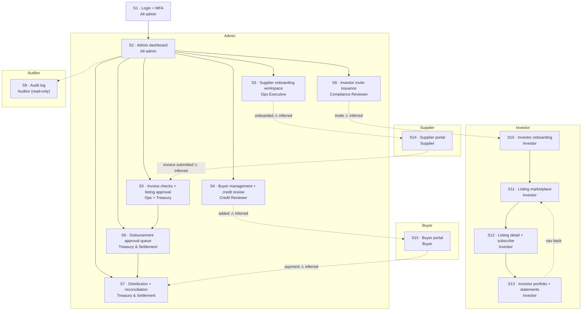

# Step 0 Output — Fintech Platform MVP

## Navigation Map (Mermaid)

> **⚠ Dashed lines** = inferred paths — confirm direction and trigger before Step 4.

---

## Flagged Paths — Awaiting Confirmation

| # | Path | Question |
|---|------|----------|
| 1 | S8 → S10 | Is the invite an email/URL (separate auth flow) or does it resolve inside the same app session? |
| 2 | S3 → S14 | Correct that completing supplier onboarding gives the supplier access to their portal? |
| 3 | S4 → S15 | Same assumption for buyers: once added via S4 they access S15? |
| 4 | S14 → S5 | Invoice submitted in S14 enters the ops queue in S5 — automatic push or manual trigger? |
| 5 | S15 → S7 | Buyer payment feeds into reconciliation in S7 — correct target? |
| 6 | S9 | Does Auditor log in via S1 → S2 → S9, or is it a completely separate read-only login? |

---

## Screen Inventory — 15 Screens

| ID | Screen | Persona | Purpose |
|----|--------|---------|---------|
| S1 | Login + MFA | All admin | Authenticate all admin users and set role in session |
| S2 | Admin dashboard | All admin | Role-scoped work queues — each persona lands here after login |
| S3 | Supplier onboarding workspace | Ops Executive | Ops completes supplier KYC/setup in "acting-as" mode |
| S4 | Buyer management + credit review | Credit Reviewer | Manage buyer entities and run credit assessment |
| S5 | Invoice checks + listing approval | Ops + Treasury | Verify invoice and approve it for the marketplace |
| S6 | Disbursement approval queue | Treasury & Settlement | Approve fund release to suppliers post-subscription |
| S7 | Distribution + reconciliation | Treasury & Settlement | Track investor distributions and match incoming buyer payments |
| S8 | Investor invite issuance | Compliance Reviewer | Issue invite codes that unlock S10 for investors |
| S9 | Audit log | Auditor | Read-only view of all platform events for the Auditor persona |
| S10 | Investor onboarding | Investor | Invite → KYC → suitability → agreement wizard for investors |
| S11 | Listing marketplace | Investor | Browse all live, fundable invoice listings |
| S12 | Listing detail + subscribe | Investor | View listing detail and commit a subscription amount |
| S13 | Investor portfolio + statements | Investor | Track active positions, returns, and statements |
| S14 | Supplier portal | Supplier | Upload invoices and monitor listing/funding status |
| S15 | Buyer portal | Buyer | Acknowledge invoices and receive payment instructions |

---

## Persona → Screen Mapping

| Persona | Screens |
|---------|---------|
| All admin (shared) | S1, S2 |
| Ops Executive | S3 |
| Credit Reviewer | S4 |
| Ops + Treasury | S5 |
| Treasury & Settlement | S6, S7 |
| Compliance Reviewer | S8 |
| Auditor | S9 |
| Investor | S10, S11, S12, S13 |
| Supplier | S14 |
| Buyer | S15 |
